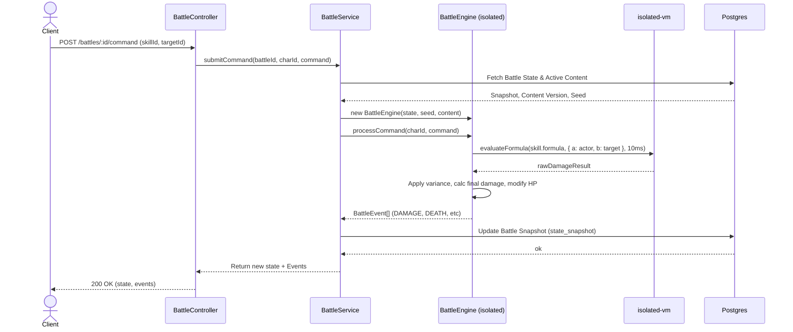
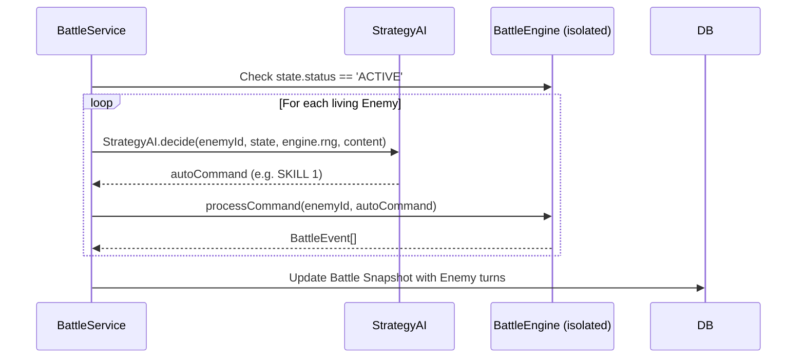

# Phase 4 (Battle Engine) Documentation

## Overview
This phase introduces a pure TypeScript authoritative battle engine that runs fully detached from the RPG Maker MV / Pixi.js client. It relies heavily on content definitions (Classes, Enemies, Skills, Items) originating from the RM MV data exports to perform accurate simulation of the engine.

## Key Concepts
- **Battle Engine**: Core simulation class `BattleEngine`. Evaluates commands, evaluates `isolated-vm` damage/heal formulas (capped at 10ms execution time for security and stability), and applies mutations generating an array of `BattleEvent` instances.
- **RNG Determinism**: Relies on a seeded `mulberry32` PRNG. A battle uses a specific `seed` to resolve actions, meaning replayability given the same commands will yield the exact same event flow and state changes.
- **AI Strategy**: Auto-battle and Enemy AI uses `StrategyAI` to deduce logical moves (e.g., healing a critical ally, or casting a basic attack).

## Sequence Diagrams

### Manual Turn Execution

### Auto Turn / Enemy Turn Execution
Enemies and auto-battling allies calculate their actions in the exact same phase directly after player execution (if still ACTIVE).

## Reward Calculation
On receiving a `BATTLE_WON` condition, the engine evaluates drop rates from the content's `Enemy.dropItems`. It uses the engine's deterministic RNG, comparing against the `denominator` (e.g., `1 / denominator`). Pending rewards are issued as `DROP` events, meaning clients can accurately animate loot acquisition before making an idempotency claim.