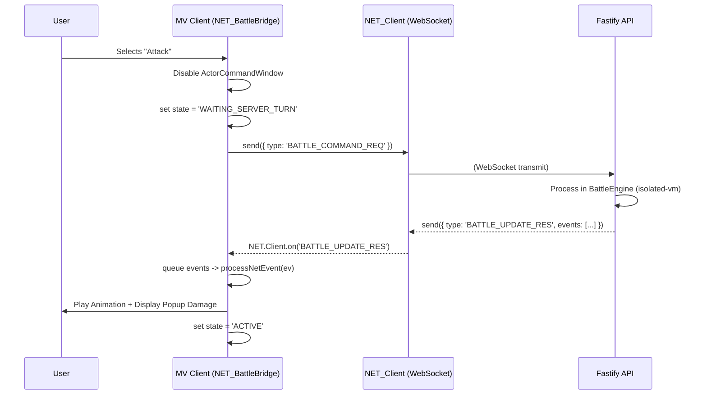

# Phase 5: RMMV Client Plugin Installation Guide

This guide describes how to install and configure the server-authoritative RPG Maker MV plugins built during Phase 4 into your main RMMV client instance.

## 1. Installation
The plugins have been generated in `apps/rmmv-client/js/plugins/`. Ensure you configure them within your RPG Maker MV Plugin Manager.
1. `NET_Client.js`
2. `NET_Auth.js`
3. `NET_BattleBridge.js`
4. `NET_ContentGuard.js`

**Important:** Keep them exactly in this load order. The `NET_Client` initiates the global `NET` namespace and must load first.

## 2. Configuration
1. **Title Screen**: `NET_Auth.js` overrides the default `Scene_Title`. It eliminates the "New Game" and "Continue" options, restricting entry strictly to token validation. 
2. **WebSocket URL**: By default, `NET_Client.js` is set to `ws://localhost:3000/battle/sync`. Modify this internally if your Fastify API server handles WS connections on a different URI.

## 3. Server Interaction Sequences
When integrated, the execution of commands looks like this:

## 4. Nullified Client Operations
Be aware that the following core MV functions have been nullified or intercepted to ensure the server remains the single source of truth:
- **`Game_Action.prototype.apply`**: Fully overridden. Damage execution locally is entirely ignored. Popups and HP reductions are issued via explicit triggers reacting to the Server's `DAMAGE` and `HEAL` events.
- **`BattleManager.setup`**: Emits `BATTLE_START_REQ` and waits for a server state snapshot instead of rendering troop immediately.
- **`DataManager.saveGame` / `loadGame`**: Returned false. Local saves are deactivated to prevent client-side save-scumming of items, equipment, and locations.
- **`Scene_Title.prototype.createCommandWindow`**: Disabled entirely.

## Next Steps
Launch the Node.js server (`npm run dev --workspace=apps/server`). Boot your RPG Maker playtest. You will be prompted to paste your login session token, establishing your connection to the local cluster.